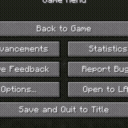

{.e_sortnum 1}
# Connection Mode
This mode creates a connection (fixed/bearing/free) between 2 objects.

Fixed mode fixes both rotations and distance between hit points

Bearing mode fixes distance, but allows rotation on an axis between points

Free mode fixes just distance, allowing objects freely rotate

