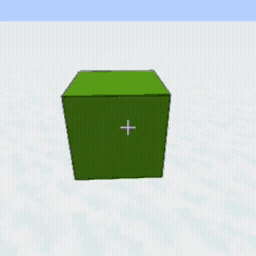
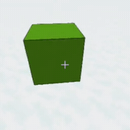
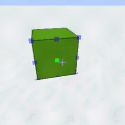

{.e_sortnum 1}
# HitPos Modes
If a toolgun mode uses positions do so something, it will have "HitPos Modes". Depending on chosen mode, it will determine how position will be calculated
* **Normal** - No transformation, uses raw position
* **Centered On Side** - Will use center of a block face it hit.
* **Centered In Block** - Will use center of a block it hit.
* **Precise Placement** - Will create n (uses "Precise Placement Side Points") squared points on a block face, and use closest to hit point.

